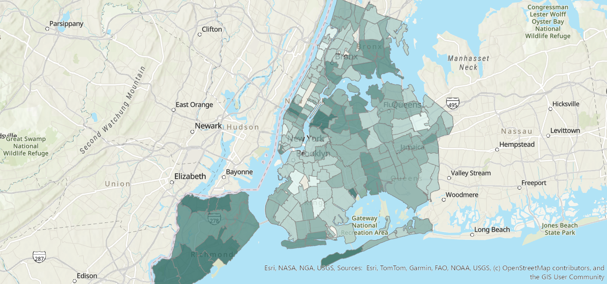
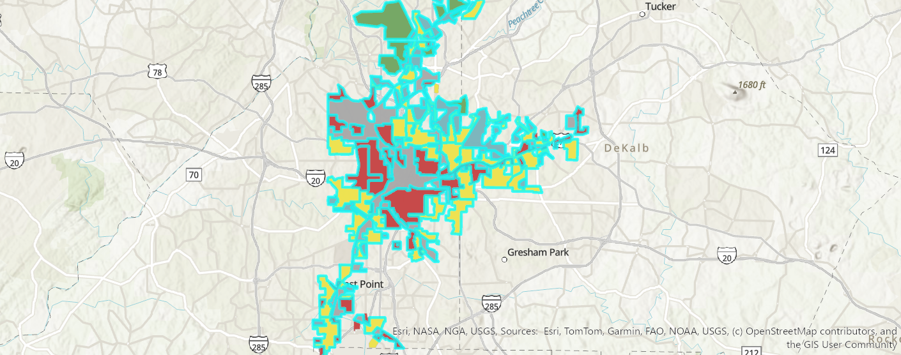

# Maria Meza
I am a student at Moreno Valley College studying Criminal Intelligence and learning how geographic data can be used to better understand real-world patterns. I want to continue to improve my GIS skills and learn how mapping can be useful for areas such as communities and public safety.
---
## COVID-19 Case Rates in New York City

*Interactive version, live as of October 2026: [*https://rccgis24.maps.arcgis.com/apps/instant/basic/index.html?appid=2cd4771177494b97ab199ba959e75749*](https://rccgis24.maps.arcgis.com/apps/instant/basic/index.html?appid=2cd4771177494b97ab199ba959e75749) 

**Question:** How did COVID-19 case rates vary across different ZIP Code Tabulation Areas in New York City, and what patterns become visible when rates are mapped instead of only raw case counts?
**Data:** I used COVID-19 data published by the New York City Department of Health and Mental Hygiene for 2020 along with ZIP Code Tabulation Area geographic data from U.S. Census Bureau.
**Method:** I added the COVID-19 ZCTA data into ArcGIS Pro and explored the attribute table to compare case counts, case rates, and population. I used Graduated Colors with five Natural Breaks classes to display differences in case rates. I then created a finished map layout with a title, legend, north arrow, scale bar, and source information. 
**A design choice I made and why:** I chose to map case rates instead of raw case counts because ZIP code areas have different population sizes. An area with more residents could have more total cases without necessarily having a higher rate. I also used a light to dark color scheme so the areas with higher rates would stand out and be easier to compare.
**A limitation of this map:** The map shows where case rates were higher or lower, but it cannot explain exactly why those differences occurred. It also groups information by ZIP code area, so it does not represent the experience or risk of any individual.
---
--7--
## Historical Redlining and Present-Day Conditions in Atlanta

**Question:** How do historical redlining patterns in Atlanta compare with present-day social and economic conditions?
**Data:** I used the Mapping Inequality Redlining Areas dataset from ArcGIS Living Atlas, based on Home Owners Loan Corporation maps created between 1935 and 1940. I also worked with modern American Community Survey and Esri demographic and housing variables.
**Method:** I used ArcGIS Pro to isolate the historical redlining areas in Atlanta and worked with enriched data containing modern demographic and housing information. I explored variables related to poverty, internet access, and housing conditions. I also used scatter plot, a correlation matrix, and boxplots to look for relationships between historical neighborhood grades and current conditions.
**A design choice I made and why:** I kept the historical HOLC grades visually distinct so it would be easier to recognize how different neighborhoods were classified. The grades ranged from A, considered the best, to D, considered hazardous. Keeping those categories clear helps readers understand the historical geographic pattern and compare different parts of Atlanta.
**A limitation of this map:** Although the data can show relationships between historical redlining and present-day conditions, it cannot prove that redlining alone caused those differences. Other economic and social changes could have affected these neighborhoods over time. The historical boundaries also do not necessarily represent how neighborhoods are organized today.
---
## Data sources
- COVID-19 ZCTA data, New York City Department of Health and Mental Hygiene, 2020: https://github.com/nychealth/coronavirus-data
- ZIP Code Tabulation Area geographic data, U.S. Census Bureau, 2020: https://www.census.gov/programs-surveys/geography/guidance/geo-areas/zctas.html
- Mapping Inequality Redlining Areas, Home Owners Loan Corporation (1935-1940), University of Richmond Digital Scholarship Lab: https://dsl.richmond.edu/panorama/redlining/
- American Community Survey, U.S. Census Bureau, 2024: https://data.census.gov/
- Enriched Atlanta GIS dataset, course-provided ArcGIS feature layer, containing ACS and Esri demographic variables: https://services1.arcgis.com/4TXrdeWh0RyCqPgB/arcgis/rest/services/Enriched_Atlanta_Geg_8/FeatureServer/0
## Where this is going
By the end of the term, I plan to add more of my GIS projects as I continue learning different mapping and spatial analysis techniques. I want this portfolio to show that I can work with geographic data, create maps that are easy to understand, and recognize patterns that might not be obvious by just looking at numbers. I also want it to show that I understand how design choices and data limitations can affect the way people interpret maps.
